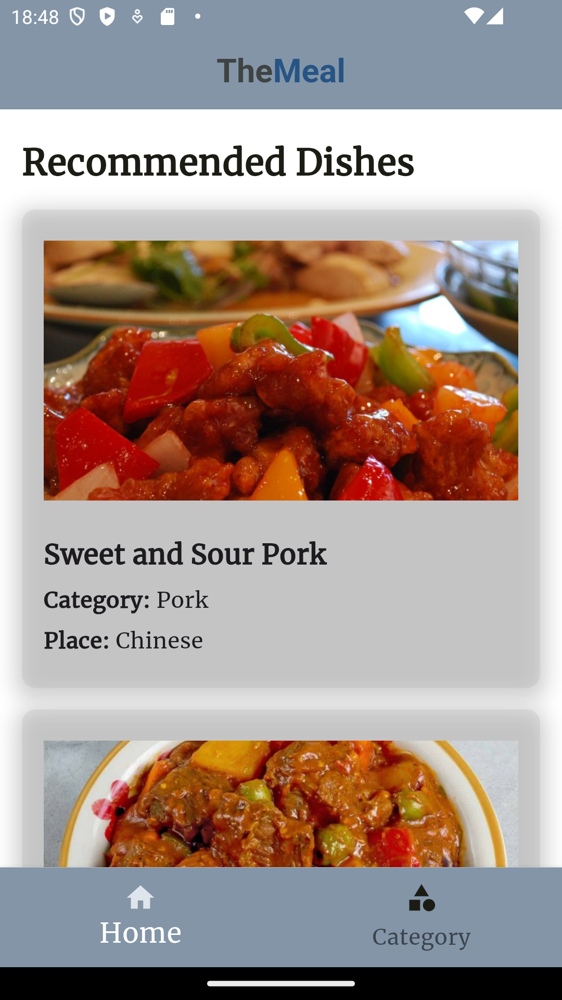
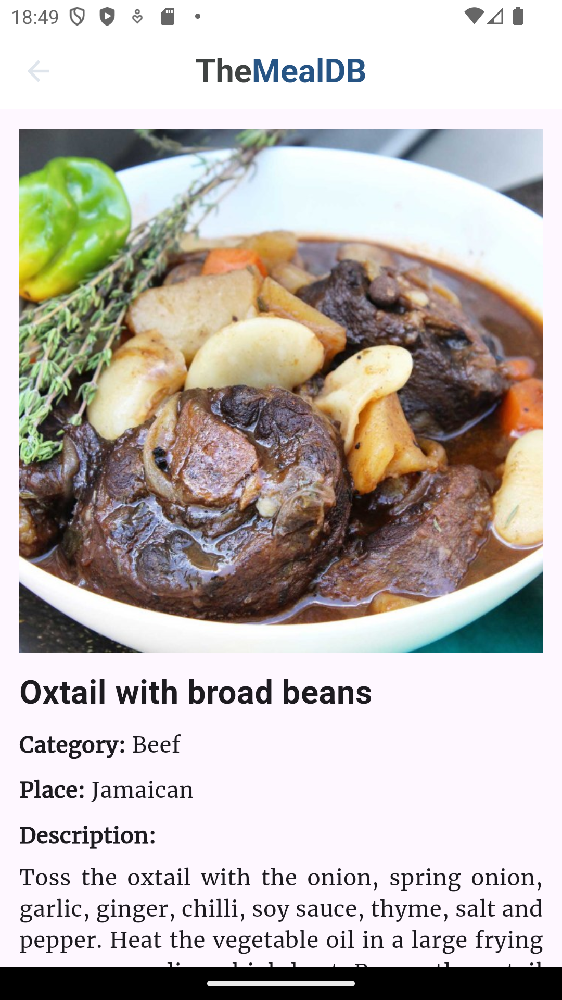
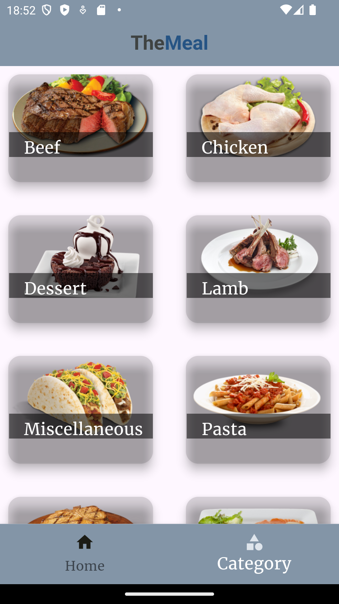
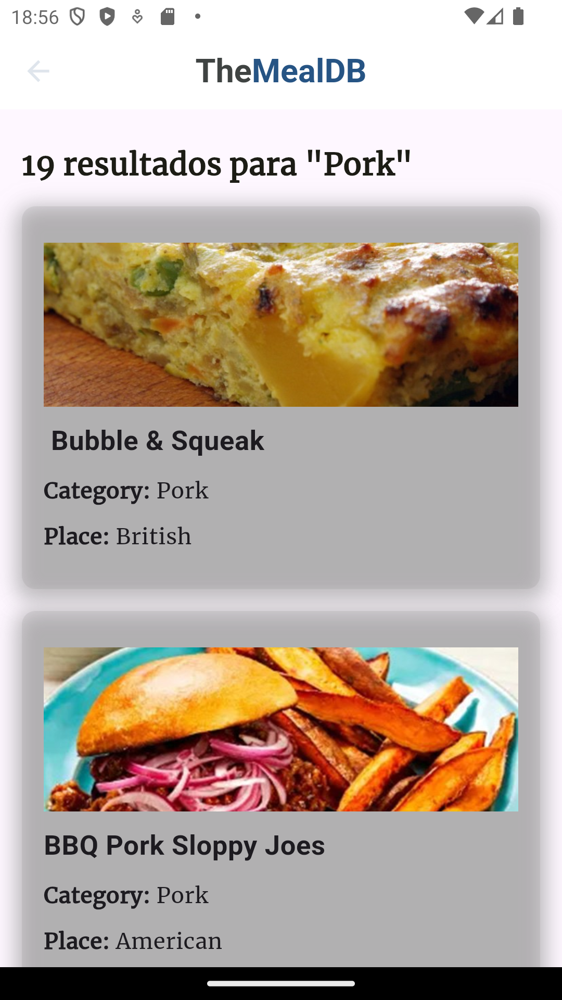

# mobil_application_course_project

Erciyes Üniversites Mobil Aplication Final Projesi
Konu: https://www.themealdb.com REST ile JSON biçiminde veri okuma yapabilen uygulama.

Okul: Erciyes Üniversitesi
Bölüm: Bilgisayar Mühendisliği
Ders: Mobile Application Development
Öğretim Üyesi: Dr. Öğr. Üyesi Fehim KÖYLÜ

Önerilen yemekleri ve kategorileri gösteren bir yemek uygulaması. 

 
 

The Meal App

</h1>

## Screenshot 📷
-📌 **ANA SAYFA**
<pre>
                 
</pre>

-📌 **Kategori Sayfası**
<pre>
          
</pre>

-📌 **Sonuç Kategorisi Ekranı**
<pre> 
                
</pre>

## Özellikler 🗃️
Bu uygulama, mobil geliştirmedeki en yeni araçları ve uygulamaları içerir!

- **Flutter** 
- **Http Request**
- **Navigation Bar** 
- **Routes**
- **API** - [The MealDB](https://www.themealdb.com/api.php)

##
##

Erviyes University Final Project
Konu: A food application that can read data in JSON format with REST from https://www.themealdb.com.

University: Erciyes University
Department: Computer Engineering
Course: Mobile Application Development
Faculty Personnel: Dr. Lecturer Member Fehim KÖYLÜ

A food app that shows recommended dishes and categories. 

 
 
The Meal
</h1>

## Screenshot 📷
-📌 **Home Screen**
<pre>
                 
</pre>

-📌 **Category Screen**
<pre>
          
</pre>

-📌 **Result Category Screen**
<pre> 
                
</pre>

## Features 🗃️
This app features all the latest tools and practices in mobile development!

- **Flutter** 
- **Http Request**
- **Navigation Bar** 
- **Routes**
- **API** - [The MealDB](https://www.themealdb.com/api.php)

Teaching personnel